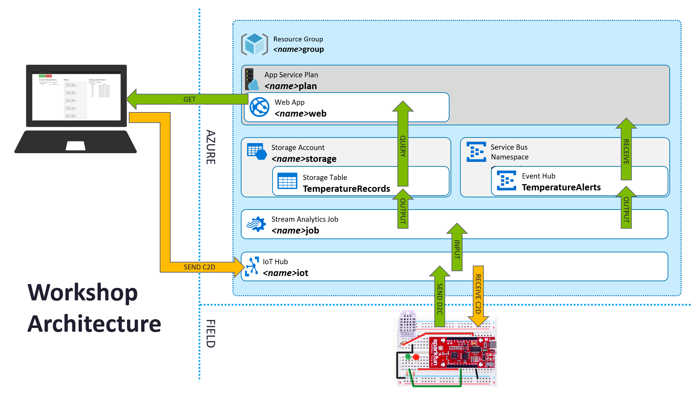
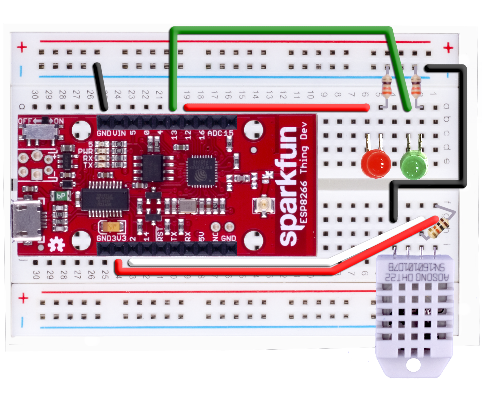
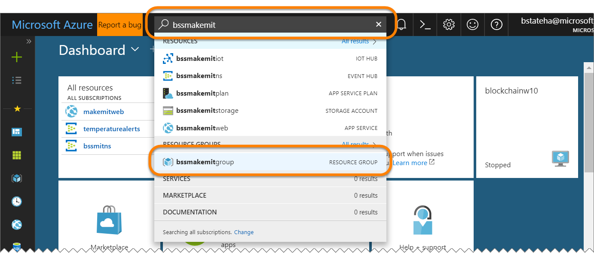
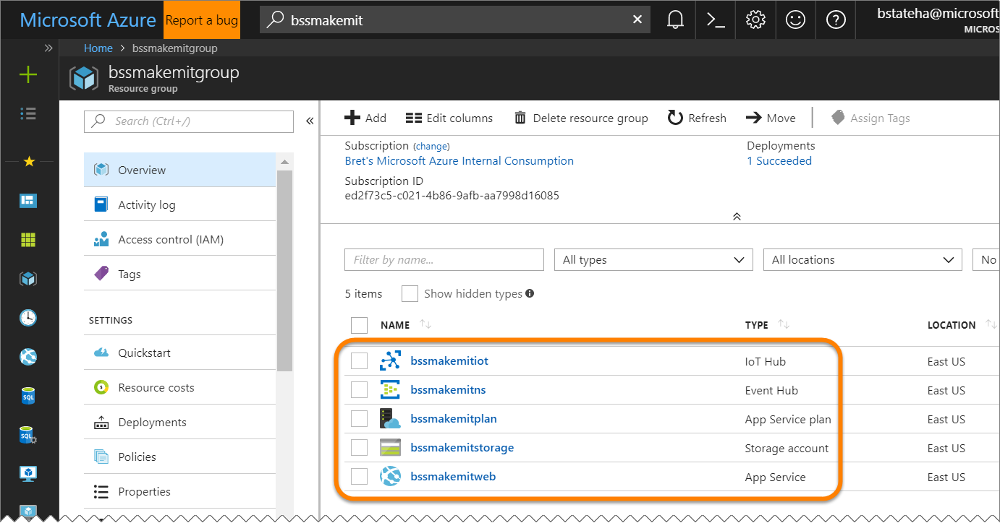
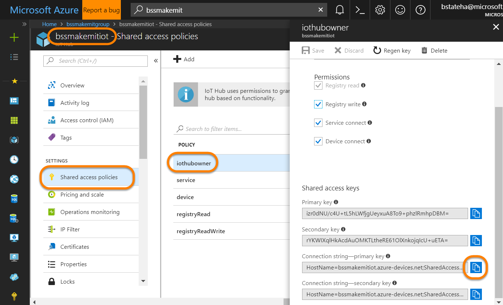

# Get Started with Microsoft Azure IoT Starter Kit - SparkFun ESP8266 Thing Dev Kit (Arduino-compatible)

***
**Looking for something simple?** This tutorial is very complete and contains a lot of detail. If you want
something quick and simple, try one of these:
* [Azure IoT HTTP protocol sample](https://github.com/Azure/azure-iot-arduino-protocol-http)
* [Azure IoT MQTT protocol sample](https://github.com/Azure/azure-iot-arduino-protocol-mqtt)
***
This page contains technical information to help you get familiar with Azure IoT using the Azure IoT Starter Kit - SparkFun ESP8266 Thing Dev Kit (Arduino-compatible). In this tutorial, you will leverage Azure IoT services to create your own IoT solution.

***
**Don't have a kit yet?:** Click [here](http://azure.com/iotstarterkits)
***

# Using Microsoft Azure IoT Services to Identify Temperature Anomalies

This tutorial describes the process of taking your Microsoft Azure IoT Starter Kit for the SparkFun ESP8266 Thing Dev Kit, and using it to develop a temperature and humidity reader that can communicate with the cloud using the  Microsoft Azure IoT SDK.

## Table of Contents

- [1.1 Tutorial Overview](#section1.1)
- [1.2 Before Starting](#section1.2)
  - [1.2.1 Required Software](#section1.2.1)
  - [1.2.2 Required Hardware](#section1.2.2)
- [1.3 Connect the Sensor Module to your Device](#section1.3)
- [1.4 Create a New Microsoft Azure IoT Hub and Add Device](#section1.4)
- [1.5 Create an Event Hub](#section1.5)
- [1.6 Create a Storage Account for Table Storage](#section1.6)
- [1.7 Create a Stream Analytics job to Save IoT Data in Table Storage and Raise Alerts](#section1.7)
- [1.8 Node Application Setup](#section1.8)
- [1.9 Add the SparkFun ESP8266 Thing Dev Kit to the Arduino IDE](#section1.9)
- [1.10 Install Library Dependencies](#section1.10)
- [1.11 Modify the Command Center Sample](#section1.11)
- [1.12 Build Your Command Center Sample](#section1.12)
- [1.13 Next steps](#section1.13)


## 1.1 Tutorial Overview

This tutorial has the following steps:
- Provision an IoT Hub instance on Microsoft Azure and adding your device.
- Prepare the device, get connected to the device, and set it up so that it can read sensor data.
- Configure your Microsoft Azure IoT services by adding Event Hub, Storage Account, and Stream Analytics resources.
- Prepare your local web solution for monitoring and sending commands to your device.
- Update the sample code to respond to commands and include the data from our sensors, sending it to Microsoft Azure to be viewed remotely.

Here's what the architecture of the solution looks like:



Here is a breakdown of the data flow:
- The application running on the Adafruit Huzzah ESP8266 will get temperature data from the temperature sensor and it will send them to the IoT Hub
- A Stream Analytics job will read the data from IoT Hub and write them to an Azure Storage Table. Also, if an anomaly is detected, then this job will write data to an Event Hub
- The Node.js application that is running on your computers will read the data from the Azure Storage Table and the Event Hub and will present them to the user

The end result will be a functional command center where you can view the history of your device's sensor data, a history of alerts, and send commands back to the device.

<a name="section1.2"></a>

## 1.2 Before Starting

<a name="section1.2.1"></a>

### 1.2.1 Required Software

- [Arduino IDE 1.8.x](https://www.arduino.cc/en/Main/Software)
- [Azure Storage Explorer](https://azure.microsoft.com/en-us/features/storage-explorer/)
- [Node.js 8.x](http://nodejs.org)
- [Git](http://git-scm.com)
- [Azure CLI 2.0](https://docs.microsoft.com/en-us/cli/azure/install-azure-cli)
- [FTDI Driver](https://learn.sparkfun.com/tutorials/how-to-install-ftdi-drivers)


<a name="section1.2.2"></a>

### 1.2.2 Required Hardware
- SparkFun ESP8266 Thing Dev Kit IoT kit
  - A microB USB cable
  - A desktop or laptop computer which can run **Arduino IDE 1.8.x**

<a name="section1.3"></a>

## 1.3 Connect the Sensor Module to your Device

- Using [this image](https://github.com/Azure-Samples/iot-hub-c-thingdev-getstartedkit/blob/master/img/thingdev_command_center.png?raw=true) as a reference, connect your DHT22 and SparkFun ESP8266 Thing Dev Kit to the breadboard



***
**Note:** Column on the left corresponds to sensor and on the Right to board. On the image, the board is place between 10 and 30 and sensor between 1 and 9. Additionally, when counting the - pins, start from the right and count in, as these do not align with the numbers indicated on the board.

**Note:** The resistors can change a little from one kit to another, e.g. it can be 330 Ohm (orange, orange, brown) or 560 Ohm (green, blue, brown). Both will work with success.
***

| Start                   | End                    | Cable Color   |
| ----------------------- | ---------------------- | ------------: |
| VDD (Pin 1G)            | Pin 24J                | Red cable   |
| Pin 19A           | Pin 6A                | Red cable   |
| DATA (Pin 2G)           | Pin 23J                | White cable  |
| GND (Pin 4G)            | Pin 1-                | Black cable   |
| GND (Pin 25A)            | Pin 21-               | Black cable   |
| Pin 20A            | Pin 3A               | Green cable   |

| Start                   | End                    | Connector     |
| ----------------------- | ---------------------- | ------------: |
| DHT22 (Pin 1I)          | DHT22 (Pin 4I)         | DHT22         |
| NULL (Pin 2H)           | Pin 1F                 | 10k Ohm Resistor  |
| GRN LED (Pin 2C)           | Pin 3C                 | Green LED  |
| RED LED (Pin 5C)           | Pin 6C                 | Red LED  |

- For more information, see: [Adafruit DHT22 sensor setup](https://learn.adafruit.com/dht/connecting-to-a-dhtxx-sensor).

**At the end of your work, your SparkFun ESP8266 Thing Dev Kit should be connected with a working sensor. We'll test it in the next sections.**

<a name="section1.4"></a>

### 1.4 Provision the Azure Resources

There are a number of ways you can create resources in Azure

- Using the Web Based Portal
- Using the Azure CLI
- Using "Azure Resource Manager" (ARM) templates

For this workshop, to help make sure we get through the creation of the resources quickly, we will be using an Azure Resource Manager (ARM) template that we deploy using the Azure CLI. 

Luckily, the Azure Portal has a built in "Cloud Shell" that we can use for this, so you don't even have to install the CLI locally.

1. Login to the [Azure Portal](https://portal.azure.com)

1. In the top right corner of the portal, click the icon for the "Cloud Sell":

    > **Note**: If you are prompted to created a Cloud Shell storage account, do it.

    

1. When the Cloud Shell opens, confirm that "Bash" is selected from the drop down in the top left corner:

    

1. In the new cloud shell panel at the bottom of the portal, Download the ARM template we'll use by running:

```bash
wget -O template.json http://aka.ms/azurethingarm
```

1. Before we create any resources, we want to come up with a consistent name prefix that we will use to name all of our resources.  If you are at a hackathon, perhaps use your team name, or make a combination of your initials, and the event name.  For this example, my initials are `bss` and I'm at `MakeMIT` so I'll  use.  Whatever you choose, use it consistently:

    ```bash
    bssmakemit
    ```

1. Next, we need to create an azure "[Resource Group](https://docs.microsoft.com/en-us/azure/azure-resource-manager/resource-group-overview#resource-groups)".

    ```bash
    az group create --name <name_prefix>group --location eastus
    ```

    For example, with the name prefix I chose of `bssmakemit` I would run:

    ```bash
    az group create --name bssmakemitgroup --location eastus
    ```

    You should see output similar to the following:

    ```bash
    {
        "id": "/subscriptions/xxxxx/resourceGroups/bssmakemitgroup",
        "location": "eastus",
        "managedBy": null,
        "name": "bssmakemitgroup",
        "properties": {
            "provisioningState": "Succeeded"
        },
        "tags": null
    }
    ```

1. Next, we'll deploy the template. **NOTE: THE COMMAND IS SHOWN ON MULTIPLE LINES BELOW FOR READBILITY.  YOU NEED TO ENTER IT ON A SINGLE LINE**. The command will take some time (even up to 10 minutes or so) so please wait for it to complete:

    ```bash
    az group deployment create 
      --name deployment 
      -g <name_prefix>group 
      --template-file template.json 
      --parameters name_prefix=<name_prefix>
    ```

    Again, as an example:

    ```bash
    az group deployment create --name deployment -g bssmakemitgroup --template-file template.json --parameters name_prefix=bssmakemit
    ```

1. Once it completes, you can enter your `<name_prefix>` in the search box at the top of the portal, then select your resource group name to view all of the resources in it:

    

    

1. Click on the `<name_prefix>iot` IoT Hub name to open it's "Blade" in the portal, then along the left, click on the "Shared Access Policies", then click the "iothubowner" policy, and finally, click the icon to copy it's "Connection String - Primary Key":

    

1. Open a new text document and make a note of the `iothubowner` connection string by typing it's name, and then on a new line pasting the connection string you just copied.  You'll need this, and some other values later so keeping them in a single document will  help you track them down easily.

1. Next, let's provision a new device in the iot hub.  In the cloud shell, run the following command:

    ```bash
    az iot device create --hub-name <name_prefix>iot --device-id <name_prefix>thing
    ```

    For example:

    ```bash
    az iot device create --hub-name bssmakemitiot --device-id bssmakemitthing
    ```

1. Then, get the connection string for the new device:

    ```bash
    az iot device show-connection-string --hub-name <name_prefix>iot --device-id <name_prefix>thing
    ```

    For example:

    ```bash
    az iot device show-connection-string --hub-name bssmakemitiot --device-id bssmakemitthing
    ```

1. Copy the connection string from the output of the previous command and paste it, along with your device id into the text document you created above.

1. When you are done with that, capture these other values and make a note of them:

    - The `<name_prefix>storage` storage account name, and primary key
    - The `<name_prefix>ns` Service Bus Namespace's `RootManageSharedAccessKey` primary connection string
    - The `tempaturealerts` event hub (note, it's INSIDE the `<name_prefix>ns` Service Bus Namespace) `readwrite` policy primary connection string
    - The 

<a name="section1.5"></a>


<a name="section1.7"></a>

## 1.7 Create a Stream Analytics job to Save IoT Data in Table Storage and Raise Alerts
Stream Analytics is an Azure IoT service that streams and analyzes data in the cloud. We'll use it to process data coming from your device.

- Log on to the [Microsoft Azure Portal](https://portal.azure.com/)
- In the menu, click **New**, then click **Internet of Things**, and then click **Stream Analytics Job**
- Enter a name for the job (We chose “SparkFunStorageJob”), a preferred region, then choose your subscription. At this stage you are also offered to create a new or to use an existing resource group. Choose the resource group you created earlier.
- Once the job is created, open your **Job’s blade** or click on the **pinned tile**, and find the section titled _“Job Topology”_ and click the **Inputs** tile. In the Inputs blade, click on **Add**
- Enter the following settings:
    - Input Alias = _`SensorReadings`_
    - Source Type = _`Data Stream`_
    - Source = _`IoT Hub`_
    - IoT Hub = _`<name_prefix>iot`_ (use the name for the IoT Hub you create before)
    - Shared Access Policy Name = _`iothubowner`_
    - Shared Access Policy Key = _The `iothubowner` primary key can be found in your IoT Hub Settings -> Shared access policies_
    - IoT Hub Consumer Group = "" (leave it to the default empty value)
    - Event serialization format = _`JSON`_
    - Encoding = _`UTF-8`_

- Back to the **Stream Analytics Job blade**, click on the **Outputs** tile and in the **Outputs blade**, click on **Add**
- Enter the following settings then click on **Create**:
    - Output Alias = _`TemperatureRecords`_
    - Sink = _`Table Storage`_
    - Subscription = _`Provide table settings storage manually`_
    - Storage account = _`<name_prefix>storage`_ (The storage account you created earlier)
    - Storage account key = _(The primary key for the storage account made earlier, can be found in Settings -&gt; Keys -&gt; Primary Access Key)_
    - Table Name = _`TemperatureRecords`_ (Your choice - If the table doesn’t already exist, Local Storage will create it)
    - Partition Key = _`DeviceId`_
    - Row Key = _`EventTime`_
    - Batch size = _`1`_
- Back to the **Stream Analytics Job blade**, click on the **Outputs tile**, and in the **Outputs blade**, click on **Add**
- Enter the following settings then click on **Create**:
    - Output Alias = _`TemperatureAlerts`_
    - Sink = _`Event Hub`_
    - Subscription = _`Provide table settings storage manually`_
    - Service Bus Namespace = _`<name_prefix>ns`_
    - Event Hub Name = _`temperaturealerts`_ (The Event Hub you made earlier)
    - Event Hub Policy Name = _`readwrite`_
    - Event Hub Policy Key = _`Primary Key for readwrite Policy name`_ (That's the one you wrote down after creating the event hub)
    - Partition Key Column = _`0`_
    - Event Serialization format = _`JSON`_
    - Encoding = _`UTF-8`_
    - Format = _`Line separated`_

- Back to the **Stream Analytics Job blade**, click on the **Query tile** (next to the Inputs tile). In the Query settings blade, type in the below query and click **Save**:

```
SELECT
    DeviceId,
    EventTime,
    MTemperature as TemperatureReading
INTO
    TemperatureRecords
from SensorReadings
WHERE
   DeviceId is not null
   and EventTime is not null

SELECT
    DeviceId,
    EventTime,
    MTemperature as TemperatureReading
INTO   
    TemperatureAlerts
FROM
    TempSensors
WHERE MTemperature>25
```

***
**Note:** You can change the `25` to `0` when you're ready to generate alerts to look at. This number represents the temperature in degrees celsius to check for when creating alerts. 25 degrees celsius is 77 degrees fahrenheit.
***


- Back in the **Stream Analytics blade**, start the job by clicking on the **Start** button at the top, and selecting **Now** as the start time. 

***
**Note:** Make sure to **stop** your Command Center jobs once you have when you take a break or finish to avoid unnecessary Azure consumption!  (See: [Troubleshooting](#troubleshooting))
***

<a name="section1.8"></a>

## 1.8 Node Application Setup

 - If you do not have it already, install Node.js and NPM.
   - Windows and Mac installers can be found here: https://nodejs.org/en/download/
     - Ensure that you select the options to install NPM and add to your PATH.
   - Linux users can use the commands:

```
sudo apt-get update
sudo apt-get install nodejs
sudo apt-get install npm
```

- Additionally, make sure you have cloned the project repository locally by issuing the following command in your desired directory:

```
git clone https://github.com/Azure-Samples/iot-hub-c-thingdev-getstartedkit.git
```

- Open the `command_center_node` folder in your command prompt (`cd <path to locally cloned repro>/command_center_node`) and install the required modules by running the following:

```
npm install -g bower
npm install
bower install
```

- Open the `config.json` file and replace the information with your project.  See the following for instructions on how to retrieve those values.

    - eventhubName:
        - Open the [Classic Azure Management Portal](https://manage.windowsazure.com)
        - Open the Service Bus namespace you created earlier
        - Switch to the **EVENT HUBS** page
        - You can see and copy the name of your event hub from that page
    - ehConnString:
        - Click on the name of the event hub from above to open it
        - Click on the "CONNECTION INFORMATION" button along the bottom.
        - From there, click the button to copy the readwrite shared access policy connection string.
    - deviceConnString:
        - Use the information on the [Manage IoT Hub](https://github.com/Azure/azure-iot-sdks/blob/master/doc/manage_iot_hub.md) to retrieve your device connection string using either the Device Explorer or iothub-explorer tools.
    - iotHubConnString:
        - In the [Azure Portal](https://portal.azure.com)
        - Open the IoT Hub you created previously.
        - Open the "Settings" blade
        - Click on the "Shared access policies" setting
        - Click on the "service" policy
        - Copy the primary connection string for the policy
    - storageAccountName:
        - In the [Azure Portal](https://portal.azure.com)
        - Open the classic Storage Account you created previously to copy its name
    - storageAccountKey:
        - Click on the name of the storage account above to open it
        - Click the "Settings" button to open the Settings blade
        - Click on the "Keys" setting
        - Click the button next to the "PRIMARY ACCESS KEY" top copy it
    - storageTableName:
        - This must match the name of the table that was used in the Stream Analytics table storage output above.
        - If you used the instructions above, you would have named it ***`TemperatureRecords`***
        - If you named it something else, enter the name you used instead.    

```
{
    "port": "3000",
    "eventHubName": "event-hub-name",
    "ehConnString": "Endpoint=sb://name.servicebus.windows.net/;SharedAccessKeyName=readwrite;SharedAccessKey=aaaaaaaaaaaaaaaaaaaaaaaaaaaaaaaaaaaaaaaaaaa=",
    "deviceId": "iot-hub-device-name",
    "iotHubConnString": "HostName=iot-hub-name.azure-devices.net;SharedAccessKeyName=service;SharedAccessKey=aaaaaaaaaaaaaaaaaaaaaaaaaaaaaaaaaaaaaaaaaaa=",
    "storageAcountName": "aaaaaaaaaaa",
    "storageAccountKey": "aaaaaaaaaaaaaaaaaaaaaaaaaaaaaaaaaaaaaaaaaaaaaaaaaaaaaaaaaaaaaaaaaaaaaaaaaaaaaaaaaaaaaa==",
    "storageTable": "TemperatureRecords"
}
```

- Now it is time to run it! Enter the following command:

```
node server.js
```

- You should then see something similar to:

```
app running on http://localhost:3000
client connected
```

- Visit the url in your browser and you will see the Node app running!

To deploy this project to the cloud using Azure, you can reference [Creating a Node.js web app in Azure App Service](https://azure.microsoft.com/en-us/documentation/articles/web-sites-nodejs-develop-deploy-mac/).

Next, we will update your device so that it can interact with all the things you just created.

<a name="section1.9"></a>

## 1.9 Add the SparkFun ESP8266 Thing Dev Kit to the Arduino IDE

You will need to install the SparkFun ESP8266 Thing Dev Kit board extension for the Arduino IDE:

- Follow the instructions here: https://learn.sparkfun.com/tutorials/esp8266-thing-development-board-hookup-guide. There you will see how to add a URL pointing to Spark's repository of board extensions, how to make the SparkFun ESP8266 Thing Dev Kit board selectable under the **Tools** menu, and how to get the Blink sketch to run.
- After going through this, you should have a working sample with a blinking light on your board.
    - If you can’t upload the sample, reconnect the device, then the power switch to OFF. Press the upload button, and flip the switch back to ON.

<a name="section1.10"></a>

## 1.10 Install Library Dependencies

For this project, we'll also need the following libraries:

 - DHT Sensor Library
 - Adafruit DHT Unified
 - AzureIoTHub
 - AzureIoTUtility
 - AzureIoTProtocol_MQTT

To install them, click on the `Sketch -> Include Library -> Manage Libraries`. Search for each library using the box in the upper-right to filter your search, click on the found library, and click the "Install" button.

The Adafruit Sensor library is also needed. This can be downloaded [here](https://github.com/adafruit/Adafruit_Sensor). Instructions for manually installing a library can be found [here](https://www.arduino.cc/en/Guide/Libraries).

<a name="section1.11"></a>

## 1.11 Modify the Command Center sample

- Unzip the example code, and double-click the file `command_center.ino` to open the project in the Arduino IDE.
- You will be prompted to creat a folder. Do this, and move the other files in the folder into the newly created child folder
- Look for the following lines of code:

```
static const char ssid[] = "[Your WiFi network SSID or name]";
static const char pass[] = "[Your WiFi network WPA password or WEP key]";
static const char* connectionString = "[Device Connection String]";
```

- Replace the placeholders with your WiFi name (SSID), WiFi password, and the device connection string you created at the beginning of this tutorial. 
- Save with `Control-s`

- In the same project, click on the `command_center.c` tab to see that file.
- Look for the following lines of code:

```
static const char DeviceId[] = "[Device Name]";
static const char connectionString[] = "[Device Connection String]";
```

- Replace the placeholders with your Device ID and connection string you created at the beginning of this tutorial. 
- Save with `Control-s`

<a name="section1.12"></a>

## 1.12 Build Your Command Center Sample

- Build and upload the code using **Sketch -&gt;  Upload**.

***
**Note**: As of 1.6.8, the Arduino IDE doesn't properly show "Upload Completed", even when it succeeds.
***

- There should now be a green LED on your SparkFun ESP8266 Thing Dev Kit. Re-select the COM port if necessary, and then open the Serial Monitor. After 15 seconds you should see a measurements update.
- Data is now being sent off at regular intervals to Microsoft Azure. When it detects something out of range, you will see the LED you’ve set up turn from green to red!
- You can click the green button (labeled "Turn on") and the red button (labeled "Turn off") in the application to toggle the green and red LEDs in your kit.

Head back to your Node application and you will have a fully functional command center, complete with a history of sensor data, alerts that display when the temperature got outside a certain range, and commands that you can send to your device remotely.

1. If you want to monitor the messages from your device in the IoT Hub itself you can use the "iothub-explorer". To install it run:

    ```bash
    npm install -g iothub-explorer
    ```

1. The `iothub-explorer` command line tool let's you do a bunch of things with your IoT Hub.  However, it will need to be able to connect to your IoT Hub with the proper permissions.  To help it out, we'll get the connection string for the `iothubowner` Shared Access Policy.  `iothubowner` is a builtin set of credentials that applications can use to have full access to the IoT Hub.  To get the connection string, run:

    ```bash
    az iot hub show-connection-string --name <name_prefix>iot
    ```

    For example:

    ```bash
    az iot hub show-connection-string --name bssmakemitiot
    ```

    You should see output similar to the following:

    ```bash
    {
        "connectionString": "HostName=bssmakemitiot.azure-devices.net;SharedAccessKeyName=iothubowner;SharedAccessKey=HVHeC2s5kz5oQq6FnaI842SKpgYQe="
    }
    ```

    Copy JUST the value of the connection string (starts with '"HostName=....' and ends with '="'),.  You'll use that as the login credentials for the `iothub-explorer` in the next step. 

1. To monitor the events (if any) sent by your device to the event hub, you can run the following:

    ```bash
    iothub-explorer monitor-events <name_prefix>thing -l "<CONNECTION STRING COPIED ABOVE>"
    ```

    For example

    ```bash
    iothub-explorer monitor-events bssmakemitthing -l "HostName=bssmakemitiot ...snip... 42SKpgYQe="
    ```

    If your device is sending messages you should see output similar to the following:

    ```bash
    Monitoring events from device thing...
    ==== From: 'bssmakemitthing' at '2018-02-23T22:41:37.982Z' ====
    {
    "DeviceId": "bssmakemitthing",
    "EventTime": 1519425696,
    "MTemperature": 26,
    "Humidity": 31
    }
    ---- application properties ----
    {}
    ====================

    ...
    
    ```

***
**Note:** Make sure to **stop** your Command Center jobs once you have when you finish to avoid unnecessary Azure consumption!  (See: [Troubleshooting](#troubleshooting))
***

<a name="section1.13"></a>

## 1.13 Next steps

Please visit our [Azure IoT Dev Center](https://azure.microsoft.com/en-us/develop/iot/) for more samples and documentation on Azure IoT.

# Troubleshooting

## Stopping Provisioned Services

- In the [Microsoft Azure Portal](https://portal.azure.com/)
    - Click on "All Resources"
    - For each Stream Analytics and Web App resource:
        - Click on the resource and click the "Stop" button in the new blade that appears
    - For each IoT Hub resource:
        - Click on the resource and click the "Devices" button in the new blade that appears
        - Click on each device in the list and click the "Disable" button that appears in the new blade at the bottom

## Data is not showing up in the Node.js application

In this section we will explain how to see the data flowing from the Arduino application to the Node.js application:
- Arduino application: In the Arduino IDE go to Tools -> Serial Monitor
- IoT Hub: Use [Device Explorer](https://github.com/Azure/azure-iot-sdks/blob/master/tools/DeviceExplorer/doc/how_to_use_device_explorer.md)
- Azure Storage Table: Use [Azure Storage Explorer](http://storageexplorer.com/)
